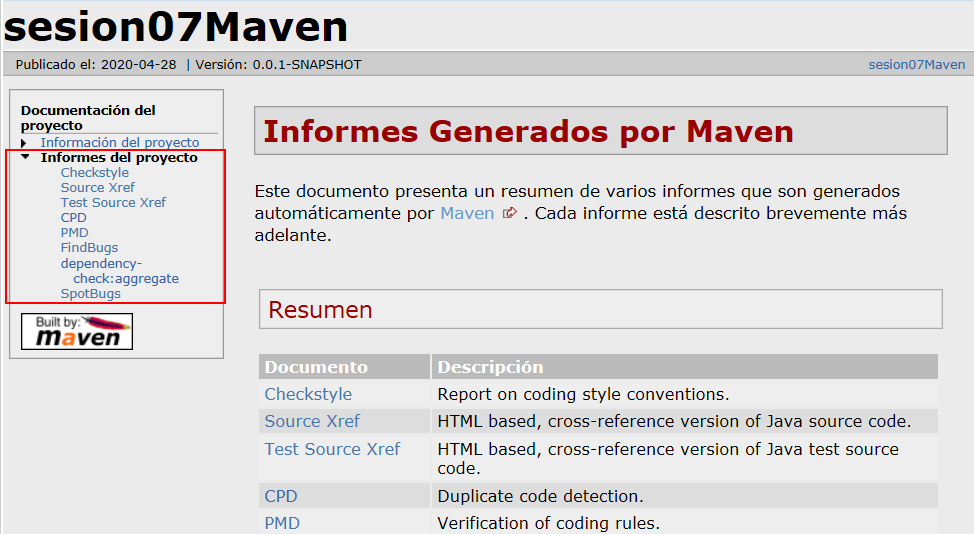
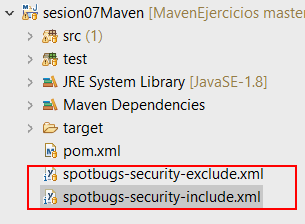

# MavenEjercicios

[](https://codecov.io/gh/ualhmis/mavenEjercicios)
    
## Tutorial

https://ualhmis.github.io/MavenEjercicios

## Instrucciones adicionales

Recomendación de proceder en esta práctica:
1. Clona este repositorio en tu PC, y prueba que se construya correctamente en tu Eclipse, ejecutando los goals `clean package`. 
    - Debes configurar correctamente JDK en tu Eclipse tal y como se explica en el guión. Aunque se recomienda JDK8, también funciona con JDK11 y JDK14 (aun no lo hemos validado con JDK13).
    - Para estar seguro de que todo ha ido bien, comprueba que se han ejecutado todos los tests y que en la carpeta `target/site/jacoco` se ha generado el informe de cobertura. 
    - Para comprobar que se generan correctamente los __informes de análisis estático de código__, ejecuta los goals `clean package site`. De esta manera se crea el informe completo `target/site/index.html`. En el enlace _informes del proyecto_ deben aparecer todos.


  
Si hay errores, el problema es de tu Eclipse: revisa la configuración de JDK.

2. Cuando funcione correctamente, abre el archivo `pom.xml` de este proyecto que tienes clonado y **copia el contenido** completo excepto las primeras lineas, es decir, desde la línea `<properties>` hasta el final, y pégalo en el archivo `pom.xml` de tu proyecto, reemplazando del contenido que tenías por este. Si lo prefieres, ve copiando bloque a bloque de `pom.xml` a medida que se explica en el guión. Pero ten en cuenta: 
    - No es recomendable escribir el código del archivo pom.xml a mano, porque la sintaxis XML es propensa a errores y Eclipse no comprueba gran parte de los errores que puedes cometer.
    - Tampoco es recomendable copiar los bloques de código desde el documento pdf del guión, ya que algunos caracteres no se copian bien del pdf a texto plano (como los guiones '-').
    - __IMPORTANTE__: no olvides copiar también en tu proyecto los archivos `spotbugs-security-exclude.xml` y `spotbugs-security-include.xml` en la carpeta raiz de tu proyecto, al mismo nivel del `pom.xml`. __SpotBugs__ es la versión actualizada de __FindBugs__ que incluye errores de seguridad. En el archivo `spotbugs-security-include.xml` aparecen los tipos de erorres que va a buscar, en principio solo los de seguridad (`SECURITY`), pero puedes configurarlo para que busque también los de correctitud (`CORRECTNESS`), código malicioso (`MALICIOUS_CODE`), malas prácticas (`BAD_PRACTICE`), etc, modificando la linea `Bug category` (más info [aquí](https://spotbugs.readthedocs.io/en/stable/bugDescriptions.html)): 

    `<Bug category="SECURITY,MALICIOUS_CODE,CORRECTNESS,BAD_PRACTICE "/>`



3. Pruébalo poco a poco, es decir, ejecutando  los goals que se indican en cada paso del guión. Para los informes de análisis estático de código, como __FindBugs__, comprobarás que al ejecutar `clean package findbugs:findbugs` solamente se genera el informe en formato XML en el archivo `target/findbugsXml.xml`, pero no se genera informe en formato HTML. Si deseas visualizar el informe de __Findbugs__ en formato HTML debes ejecutar los goals `clean package site`. Lo mismo ocurre para __SpotBugs__: si deseas ejecutarlo "solo" debes lanzar los goals `clean package com.github.spotbugs:spotbugs-maven-plugin:spotbugs`, pero eso solo generará el archivo xml `target/spotbugsXml.xml`. El informe  HTML solamente se obtiene al lanzar el goal `site`.

## FAQ - Solución de problemas - Troubleshooting

1. Error en __javadoc__:

    `Unable to find javadoc command: The environment variable JAVA_HOME is not correctly set. -> [Help 1].`

    __Solución__: Añade manualmente la variable `JAVA_HOME` en la configuración de ejecución [así - stackoverflow](https://stackoverflow.com/a/36685840)

    `JAVA_HOME` debe indicar la carpeta en la que Java JDK está instalado en tu PC. En Windows 10, busca en `C:\Program Files\Java\` y busca la versión concreta de JDK instalada, por ejemplo, si tienes instalado JDK8 será:

        Correct! - C:\Program Files\Java\jdk1.8.0_211
        Wrong    - C:\Program Files\Java\jdk1.8.0_211\bin
        Wrong    - C:\Program Files\Java\jdk1.8.0_211\jre
        Wrong    - C:\Program Files\Java\jre1.8.0_211\bin

2. Error en __javadoc__ por la versión de Java: 

    __Solución__: Añade la versión de java en la configuración del plugin javadoc en el `pom.xml`

```
	<plugin>
		<groupId>org.apache.maven.ugins</groupId>
		<artifactId>maven-javadoc-plun</artifactId>
		<version>3.2.0</version>
		<configuration>
			<source>8</source>
		</configuration>			
	</plugin>
```

3. Error en `site`:
    
    `Could not find resource '.../spotbugs-security-include.xml'. -> [Help 1]`

    __Solución__: copia en tu proyecto los archivos `spotbugs-security-exclude.xml` y `spotbugs-security-include.xml` en la carpeta raiz de tu proyecto, al mismo nivel del `pom.xml`

4. Error de formatos `HTML,XML` en Dependecy Check: 


La solución es poner cada formato en su propia etiqueta `format`:

````
    <plugin>
		<groupId>org.owasp</groupId>
		<artifactId>dependency-check-maven</artifactId>
		<version>5.3.2</version>
		<configuration>
			<skipTestScope>false</skipTestScope>
			<formats>
				<format>HTML</format>
				<format>XML</format>
			</formats> 
		</configuration>
        ...
    </plugin>
````     