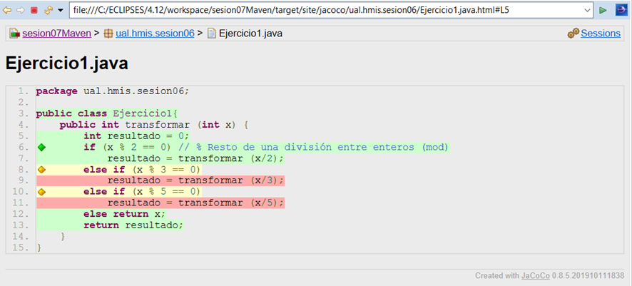

////
Codificación, idioma, tabla de contenidos, tipo de documento
////
:encoding: utf-8
:lang: es
:toc: right
:toc-title: Tabla de contenidos
:keywords: Maven HMIS
:doctype: book
:icons: font

////
/// activar btn:
////
:experimental:

:source-highlighter: rouge
:rouge-linenums-mode: inline

// :highlightjsdir: ./highlight

:figure-caption: Figure
:example-caption!: 

// Eliminar el bloque final "last updated"
:reproducible:      

// PDF
:pdf-style: themes/my-theme.yml
:title_page: false
// Bloque de codigo en pdf: no incluir la sección "Tabla de contenidos"
ifdef::backend-pdf[]
:toc!:
endif::[]

////
///  Copy button on code blocks
////
[.doc]

:docinfo: shared-footer

////
Nombre y título del trabajo
////
= Maven
Herramientas y Métodos de Ingeniería del Software
Version 2.2, Abril-2025
Joaquín Cañadas <jjcanada@ual.es>

// Entrar en modo no numerado de apartados
:numbered!: 

[abstract]
////
COLOCA A CONTINUACIÓN EL RESUMEN
////

https://maven.apache.org/what-is-maven.html[Maven] es una herramienta de automatización de la construcción (_build_) y gestión de dependencias para proyectos Java. Maven se encarga de la gestión del ciclo de vida del proyecto, incluyendo la compilación, la ejecución de los test, la generación de documentación, el empaquetado y la distribución del software. Además, proporciona un sistema de construcción estandarizado y una estructura de proyecto coherente, lo que hace que sea más fácil para los desarrolladores trabajar en proyectos grandes y complejos. Además, proporciona gestión de dependencias, es decir, permite que un proyecto pueda utilizar librerías de terceros sin tener que preocuparse de cómo se instalan, cómo se actualizan, etc. Pero Maven es mucho más que eso: el objetivo principal de es permitir que un desarrollador comprenda el estado completo de un esfuerzo de desarrollo en el menor tiempo posible. Para lograr este objetivo, Maven se ocupa de varias áreas:

- _Facilitar el proceso de construcción_

- _Proporcionar un sistema de construcción uniforme_

- _Proporcionar información de proyectos de calidad_

- _Fomentar mejores prácticas de desarrollo_

////
COLOCA A CONTINUACIÓN LOS OBJETIVOS
////
.Objetivos
- Crear un proyecto nuevo en Maven y _mavernizar_ un proyecto existente.
- Configurar el archivo `pom.xml` para incluir las dependencias necesarias para el proyecto.
- Añadir y configurar plugins para realizar las tareas básicas, como ejecutar los tests unitarios, obtener la cobertura de los tests, análisis estático de código, generación de documentación JavaDoc, diagramas de clases, etc.
- Realizar análisis de dependencias con OWASP Dependency Check.

== Prerrequisitos

Para realizar esta actividad debes partir del o de los proyectos realizado(s) en la(s) *actividad(es) previa(s)* sobre *Pruebas Unitarias en JUnit 5*.

[NOTE] 
====
Los ejemplos de código y capturas de pantalla de esta actividad se basan en el repositorio https://github.com/ualhmis/hmis-coches.
====

=== Configuración del UTF-8 en el IDE
Antes de empezar, asegúrate de que el IDE que estás utilizando está configurado para trabajar con UTF-8.

==== Eclipse
====
image:images/eclipse_2.png[Eclipse] Si estás usando Eclipse, no olvides configurar Eclipse para que utilice UTF-8 como codificación predeterminada: _Window > Preferencies > General > Workspace > Text file encoding > Other > UTF-8_

image::images/eclipse-utf8.png[Eclipse utf8]
====

==== Visual Studio Code
====
 Si usas VS Code para desarrollar en Java debes tener en cuenta que, a diferencia de Eclipse que el propio _bundle_ ya incorpora todas las depedencias para trabajar en Java (JRE, JUnit, Maven, etc.), en VS Code debes instalar y configurar esas herramientas de manera independiente en tu sistema.

. Debes tener instalado Java JDK en tu sistema, así como Maven. Descarga Maven desde https://maven.apache.org/download.cgi[Downloading Apache Maven] y sigue las instrucciones de instalación https://www.baeldung.com/install-maven-on-windows-linux-mac[How to Install Maven on Windows, Linux, and Mac].

. En VSCode, instala las extensiones Java, Maven, Java Debugger,...

image::images/vscode-extensions_Java.png[vscode-extensions_Java, width=50%]

[start=3]
. Si no configuras el UTF-8 en el IDE, los tests de caracteres con acentos o con eñes fallarán. Configurar UTF-8 en la compilación y depuración con Java: Extensions / Java Debugger

Esto se traduce en el archivo de `settings.json` del usuario en:

[source,json]
----
   "java.debug.settings.vmArgs": "-Dfile.encoding=UTF-8"
----
====

# Pasos a seguir

// Entrar en modo numerado de apartados
:numbered:

## Crear un proyecto Maven 

image:images/eclipse_2.png[Eclipse] Desde Eclipse, para crear un proyecto Maven: _New >  Maven Project_. En la siguiente ventana, selecciona la opción _Create a simple project (skip archetype selection)_.

Introduce los datos básicos: 

- Group id: `ual.hmis`, es el identificador del grupo del proyecto.
- Artifact id: `sesionXX`, es el identificador de artefacto (proyecto)
- Version: `0.0.1-Snapshot`, es la version del artefacto bajo el grupo especificado
- Packaging: `jar`, es el tipo de empaquetado del artefacto. En este caso, un archivo `.jar` ejecutable.

image::images/New-Maven-Project-groupid.png[New-Maven-Project]

La estructura predeterminada de un proyecto Maven sigue una convención denominada "Standard Directory Layout" (Estructura de Directorios Estándar), que proporciona una forma coherente de organizar los archivos de un proyecto. Esta estructura se compone de los siguientes directorios y subdirectorios:

====
- El directorio `src/main/java` contiene el código fuente principal del proyecto.
- El directorio `src/main/resources` contiene los recursos (archivos de configuración, archivos de propiedades, etc.) necesarios para que el proyecto se ejecute.
- El directorio `src/test/java` contiene los archivos de prueba del proyecto.
- El directorio `src/test/resources` contiene los recursos necesarios para las pruebas.
- El archivo `pom.xml` es el archivo de configuración de Maven que describe cómo se debe construir el proyecto, incluyendo las dependencias, plugins y otros detalles.
- El directorio `target` es donde Maven coloca los resultados de la construcción y el empaquetado del proyecto.
====

====
*Convertir a proyecto Maven*

image:images/eclipse_2.png[Eclipse] Si partes de un proyecto que ya tiene contenido pero no está mavenizado(s), hazlo ahora:

Sobre el proyecto, botón derecho, _Configure_, _Convert to maven project_

image::images/convert-to-maven-project.png[convert-to-maven-project]

Verás que se ha creado un nuevo archivo llamado `pom.xml` que es el que contiene la configuración de Maven para el proyecto.

 Si usas VS Code para desarrollar en Java, crea manualmente el archivo `pom.xml` en la raíz del proyecto, con el contenido básico que aparece en la siguiente sección.
====

## Archivo de configuración de Maven: `pom.xml`

El archivo `pom.xml` es el archivo de configuración principal de un proyecto Maven. Contiene información sobre el proyecto y la configuración de Maven para construirlo. El archivo `pom.xml` se encuentra en la raíz del proyecto y sigue un formato XML específico.

El contenido mínimo del `pom.xml` es:

* `project` root
* `modelVersion` - debe ser `4.0.0`
* `groupId` - identificador del grupo del proyecto.
* `artifactId` - identificador de artefacto (proyecto)
* `version` - version del artefacto bajo el grupo especificado

Los parámetros `groupId`, `artifactId`, y `version` forma el nombre completo de artefacto del proyecto (project's fully qualified artifact name). Este nombre tiene la forma `<groupId>:<artifactId>:<version>`. En el ejemplo anterior, sería `ual.hmis.sesionXX:0.0.1-SNAPSHOT`.

Además, el archivo `pom.xml` puede contener otros elementos opcionales, como:

* `properties` - contiene propiedades del proyecto, como la versión de Java utilizada para compilar el proyecto. En el siguiente ejemplo se establece la codificación a `UTF-8`.

* `build` - contiene la configuración de construcción del proyecto, y los plugins que se ejecutan durante la misma. En el siguiente ejemplo  se configura el plugin `maven-compiler-plugin` para que compile con *Java 21*.

[source,xml]
----
<project xmlns="http://maven.apache.org/POM/4.0.0"
    xmlns:xsi="http://www.w3.org/2001/XMLSchema-instance"
    xsi:schemaLocation="http://maven.apache.org/POM/4.0.0 https://maven.apache.org/xsd/maven-4.0.0.xsd">
    <modelVersion>4.0.0</modelVersion>
    <groupId>ual.hmis</groupId>
    <artifactId>sesion06</artifactId>
    <version>0.0.1-SNAPSHOT</version>
    <properties>
        <project.build.sourceEncoding>UTF-8</project.build.sourceEncoding>
        <project.reporting.outputEncoding>UTF-8</project.reporting.outputEncoding>
    </properties>
    <build>
        <plugins>
            <plugin>
                <artifactId>maven-compiler-plugin</artifactId>
                <version>3.13.0</version>
                <configuration>
                    <release>21</release>
                </configuration>
            </plugin>
        </plugins>
    </build>
</project>
----

## Configurar el archivo `pom.xml`

Si tu proyecto Java tiene otra estructura distinta a esta estructura de carpetas predeterminada, puedes modificarla en el archivo `pom.xml`. Por ejemplo, partiendo de la estructura de proyecto habitual en Eclipse, los fuentes están en la carpeta `src` y las clases con tests en la carpeta `test`. 

[source,xml]
----
<build>
  <sourceDirectory>src</sourceDirectory>
  <testSourceDirectory>test</testSourceDirectory>
   ...
</build>
----

También puedes modificar las carpetas donde se guardan los `resources`, archivos necesarios para el proyecto. Por ejemplo, si quieres modificarlos a las mismas carpetas donde están los fuentes y los tests, puedes añadir la siguiente configuración al `pom.xml`:

[source,xml]
----
<build>
	...
	<resources>
		<resource>
			<directory>src/main/java/</directory>
		</resource>	
	</resources>	
	<testResources>
		<testResource>
			<directory>src/test/java/</directory>
		</testResource>	
	</testResources>	
  ...
</build>
----

[NOTE]
====
En cualquier caso, es recomendable mantener la estructura predeterminada de Maven. Así te asegurarás de que los archivos y recursos se encuentren en las ubicaciones esperadas, facilitando la integración con herramientas y plugins de Maven.
====

## Añadir las dependencias a JUnit5

Maven proporciona gestión de dependencias, es decir, permite que un proyecto pueda utilizar librerías de terceros sin tener que preocuparse de cómo se instalan, cómo se actualizan, etc.  A partir de ahora, deberás configurar el archivo `pom.xml` para que incluya las dependencias necesarias para el proyecto.

Añade las dependencias a JUnit 5 (simplemente comprobar, ya lo habíamos hecho en la actividad 5):

[source,xml]
----
  ...
  <build>
    ...
  </build>
  <dependencies>
	<dependency>
		<groupId>org.junit.jupiter</groupId>
		<artifactId>junit-jupiter-engine</artifactId>
		<version>5.12.1</version> <1>
		<scope>test</scope>
	</dependency>
	<dependency>
		<groupId>org.junit.jupiter</groupId>
		<artifactId>junit-jupiter-api</artifactId>
		<version>5.12.1</version>
		<scope>test</scope>
	</dependency>
   	<dependency>
		<groupId>org.junit.jupiter</groupId>
		<artifactId>junit-jupiter-params</artifactId>
		<version>5.12.1</version>
		<scope>test</scope>
	</dependency>
	<dependency>
		<groupId>org.junit.platform</groupId>
		<artifactId>junit-platform-suite-engine</artifactId>
		<version>1.12.1</version>
		<scope>test</scope>
	</dependency>
  </dependencies>
  ...
----
<1> La versión de JUnit5 que usamos en el momento de escribir este documento es la `5.12.1`, pero debes comprobar la última versión en https://mvnrepository.com/artifact/org.junit.jupiter/junit-jupiter-api y usarla en tu `pom.xml`, en las tres dependencias de JUnit5.

[WARNING]
====
image:images/eclipse_2.png[Eclipse] En Eclipse, hay que eliminar JUnit del ClassPath del proyecto 

Si en el proyecto aparecen errores de compilación tras añadir las dependencias a Junit en Maven, se debe *actualizar el proyecto*: sobre el proyecto, botón derecho, _Maven, Update Project_.

====

## Lanzar los test desde Maven

Maven define un ciclo de vida (https://maven.apache.org/guides/introduction/introduction-to-the-lifecycle.html[Maven lifecycle]) para compilar/test/empaquetar el proyecto. El ciclo de vida de Maven es un conjunto predefinido de fases que describen el proceso de construcción y distribución de un proyecto. Cada fase representa una etapa específica en el ciclo de vida de construcción de un proyecto, y se ejecutan en un orden predefinido.

Los *goals* de Maven son tareas específicas que se pueden ejecutar en un proyecto durante el proceso de construcción. Cada fase del ciclo de vida de Maven está compuesta por uno o más goals, y los goals se utilizan para realizar acciones específicas, como compilar el código fuente, ejecutar pruebas, empaquetar el proyecto, instalar el proyecto en el repositorio local de Maven, y desplegar el proyecto en un servidor remoto.

Por ejemplo, en la fase *compile* del ciclo de vida de Maven, el goal principal es `compile`, que se utiliza para compilar el código fuente del proyecto y generar archivos `.class`. En la fase *test*, el goal principal es `test`, que se utiliza para ejecutar las pruebas unitarias del proyecto. En la fase *package*, el goal principal es `package`, que se utiliza para empaquetar el proyecto en un archivo `.jar` o `.war`. El goal `clean` se utiliza para limpiar el resultado de la construcción anterior, borrando en la carpeta `target`.

[WARNING]
====
La carpeta `target` *nunca* se guarda en el respositorio Git, ni se sube a GitHub. Git ignora está carpeta porque se encuentra dentro del archivo `.gitignore`.
====

En cada _goal_ se ejecutan otros _goals_ previos necesarios para que el actual se ejecute correctamente. Por ejemplo, al ejecutar `test`, Maven ejecuta previamente `compile` y `testCompile`. Del mismo modo, `package` ejecuta previamente los goals `compile`, `testCompile` y `test`.

.https://www.codetab.org/tutorial/apache-maven/maven-lifecycle-goals/[Maven lifecycle goals]
image::images/mvn-plugins-package-goals.png[maven-package-goal]

====
image:images/eclipse_2.png[Eclipse] Normalmente hasta ahora siempre hemos ejecutado los tests de JUnit desde *Eclipse*, con la opción _Run As… JUnit test_. Ahora vamos a lanzar los test desde *Maven*: _Sobre el proyecto, Botón derecho, Run as… , Maven build_. En el campo Goals: `clean package`

image::images/maven-build-clean-package.png[maven-build-clean-package]
====

====
 En VS Code, para lanzar los test desde Maven, desde el terminal ejecuta: 

[source,bash]
----
mvn clean package
----
====

WARNING: Recuerda que para ejecutar los test con Maven desde el terminal, debes tener instalado Maven en tu sistema operativo. Comprueba que lo tienes instalado con el comando `mvn -v`. Si no lo tienes instalado, puedes descargarlo desde https://maven.apache.org/download.cgi, aunque la instalación recomendada en Windows es con Chocolatey: https://chocolatey.org/packages/maven

[WARNING]
====
Si maven no compila, da error: del tipo `--release` en maven (el `pom.xml` tiene release 21):

- verifica tu variable de entorno `JAVA_HOME`.
- Debe estar configurado el valor de release a 21 ya que estoy usando JAVA 21.
- Si no es así, cambia la variable de entorno de usuario `JAVA_HOME` a la ruta de Java 21.
====

Una vez ejecutada correctamente la construcción con Maven, comprueba en la *salida por consola* que se hayan ejecutando los tests correctamente: número de tests, Passed, Failed, ...

En caso de que no se estén ejecutando los tests *(Tests run: 0)* el problema es que Maven no está encontrando los tests. Para solucionarlo es necesario configurar el plugin *Surefire*, encargado de los tests unitarios, tal y como se explica en la siguiente sección.  

Puedes comprobar el resultado de la ejecución de los test de JUnit abriendo el archivo xml generado en la carpeta `target/surefire-reports/TEST-….xml`

image::images/open-xml-test-junit.png[open-xml-test-junit]

[WARNING]
====
Si en la consola aparece el siguiente error: 

 No compiler is provided in this environment. Perhaps you are running on a JRE rather than a JDK?

En Eclipse: _Window -> Preferences -> Java -> Installed JREs_. Comprueba que está marcada una instalación de JDK en lugar de un JRE. 
 
Si no tuvieses instalado un JDK, debes instalarlo. Recomendable *JDK 21*. Tras instalarlo, debes reiniciar Eclipse y añadirlo a la lista de Installed JREs.
====

## Surefire plugin

Surefire es el plugin de Maven que se encarga de ejecutar los tests unitarios. Por defecto, Surefire busca los tests en el directorio `src/test/java` y los ejecuta. Si no se encuentra ningún test, no se ejecuta ninguno. Por eso, si no se ejecutan los tests, es porque Maven no los encuentra.

Añade esta configuración del plugin al `pom.xml`

[source,xml]
----
<build>
   <plugins>
	...
	<plugin>
		<groupId>org.apache.maven.plugins</groupId>
		<artifactId>maven-surefire-plugin</artifactId>
		<version>3.5.1</version>
	</plugin>
	...
   </plugins>
</build>
----

De forma predeterminada, Surefire incluye automáticamente todos los archivos de pruebas que cumplen las siguientes reglas de nomenclatura:

* `\**/Test*.java`, incluye todos los archivos .java que empiezan por `Test`.
* `**/*Test.java`, archivos .java que finalizan en `Test`.    
* `**/*Tests.java`, archivos .java que finalizan en `Tests`.
* `**/*TestCase.java`, archivos .java que finalizan en `TestCase`.

Si tus clases de test no siguen esta nomenclatura, debes configurar el plugin para especificar qué archivos debe incluir: 

[source,xml]
----
...
	<plugin>
		<groupId>org.apache.maven.plugins</groupId>
		<artifactId>maven-surefire-plugin</artifactId>
		<version>3.5.1</version>
		<configuration>
            <includes>
                <include>Sample.java</include>
            </includes>
		</configuration>
	</plugin>
...
----

Y si deseas excluir algún archivo de test, debes añadirlo a la lista de exclusiones:

[source,xml]
----

...
	<plugin>
		<groupId>org.apache.maven.plugins</groupId>
		<artifactId>maven-surefire-plugin</artifactId>
		<version>3.5.1</version>
		<configuration>
            <excludes>
              <exclude>**/TestCircle.java</exclude>
              <exclude>**/TestSquare.java</exclude>
            </excludes>
          </configuration>
	</plugin>
...
----

NOTE: Más info en https://maven.apache.org/surefire/maven-surefire-plugin/examples/inclusion-exclusion.html[Inclusion/Exclusion of Tests]

La siguiente https://maven.apache.org/surefire/maven-surefire-plugin/examples/junit-platform.html#external-extensions-for-the-plugin[extensión] muestra en la consola una vista en forma de árbol de las pruebas unitarias . Esto está relacionado con las pruebas JUnit5: 

[source,xml]
----
...
	<plugin>
		<groupId>org.apache.maven.plugins</groupId>
		<artifactId>maven-surefire-plugin</artifactId>
		<version>3.5.1</version>
		<dependencies>
			<dependency>
				<groupId>me.fabriciorby</groupId>
				<artifactId>maven-surefire-junit5-tree-reporter</artifactId>
				<version>1.4.0</version>
			</dependency>
		</dependencies>
		<configuration>
			<reportFormat>plain</reportFormat>
			<consoleOutputReporter>
				<disable>true</disable>
			</consoleOutputReporter>
			<statelessTestsetInfoReporter implementation="org.apache.maven.plugin.surefire.extensions.junit5.JUnit5StatelessTestsetInfoTreeReporter" />
			<argLine>@{argLine} -Dfile.encoding=UTF-8</argLine>
			<!-- -Dfile.encoding=UTF-8 necesario para que pasen los tests con UTF-8 -->		
			<!-- @{argLine} necesario para Jacoco !!! -->		
		</configuration>
	</plugin>

...
----

## Plugin de Cobertura

Para el cálculo de la cobertura desde Maven vamos a usar el plugin JaCoCo.

[source,xml]
----
<project...>
...
<build>
    <plugins>
		<plugin>
			<groupId>org.jacoco</groupId>
			<artifactId>jacoco-maven-plugin</artifactId>
			<version>0.8.12</version>
			<executions>
				<execution>
					<id>prepare-agent</id>
					<goals>
						<goal>prepare-agent</goal>
					</goals>
				</execution>
				<!-- attached to Maven test phase -->
				<execution>
					<id>report</id>
					<phase>test</phase>
					<goals>
						<goal>report</goal>
					</goals>
				</execution>
			</executions>
		</plugin>
	</plugins>
</build>
...
</project>
----

Para llamar al cálculo de cobertura desde la línea de comandos, ejecuta el siguiente comando:

 mvn clean package

Para ver el informe de cobertura, abre el archivo `target/site/jacoco/index.html` con el navegador web.

Puedes navegar y ver la cobertura linea a linea. Recuerda los colores:

Puedes verificar que los resultados de la cobertura desde Maven con JaCoCo son iguales que los resultados de la cobertura obtenidos por el plugin EclEmma de Eclipse.

## Verificar un valor mínimo de cobertura

Además, se puede añadir una regla de verificación para que la construcción solamente de éxito si la cobertura es superior a un porcentaje mínimo. 

[source,xml]
----
...
			<!-- Add this checking: coverage >= 90% -->
			<execution>
				<id>jacoco-check</id>
				<goals>
					<goal>check</goal>
				</goals>
				<configuration>
					<rules>
						<rule>
							<element>PACKAGE</element>
							<limits>
								<limit>
									<counter>LINE</counter>
									<value>COVEREDRATIO</value>
									<minimum>0.9</minimum>
								</limit>
							</limits>
						</rule>
					</rules>
				</configuration>
			</execution>
...
----

Si además quieres que se comprueben las reglas de verificación, ejecuta el siguiente los goals `clean` y `verify`:

 mvn clean verify

Si no se alcanza el mínimo, en este caso 90%, por consola se muestra el siguiente error: 

image::images\jacoco-check-failure.png[JaCoco check failure]

[NOTE]
====
Más info en https://dzone.com/articles/reporting-code-coverage-using-maven-and-jacoco-plu
[Reporting Code Coverage Using Maven and JaCoCo Plugin]
====

## Análisis estático de Código

Para mantener o aumentar la calidad de nuestro código debemos ayudarnos, entre otras herramientas, de técnicas de análisis estático de código que, básicamente, se encargan de buscar defectos en el código sin necesidad de que este se ejecute. En Java las más habituales son *Checkstyle*, *FindBugs* y *PMD*. 

* https://maven.apache.org/plugins/maven-checkstyle-plugin/[Checkstyle] valida el estilo del código respecto al estilo oficial de Java. 
* http://gleclaire.github.io/findbugs-maven-plugin/[FindBugs/Spotbugs] busca errores comunes.
* https://maven.apache.org/plugins/maven-pmd-plugin/[PMD] valida reglas de construcción y compilación.

### Site
El plugin Maven Site genera un sitio web con documentación del proyecto. Se invoca con el goal: `site`. Hay que añadirlo en el bloque `build` y en el bloque `reporting` del `pom.xml`.

[source,xml]
----
<project>
  ...
  <build>
  ...
	<plugin>
		<groupId>org.apache.maven.plugins</groupId>
		<artifactId>maven-site-plugin</artifactId>
		<version>4.0.0-M7</version>
		<configuration>
			<locales>es,en</locales>
		</configuration>
	</plugin>
	  ...
  </build>
   <reporting>
    <plugins>
		<plugin>
			<groupId>org.apache.maven.plugins</groupId>
			<artifactId>maven-site-plugin</artifactId>
			<version>4.0.0-M7</version>
			<configuration>
				<locales>es,en</locales>
			</configuration>
		</plugin>
        ...
	</plugins>
  </reporting>
  ...
</project>
----

### Checkstyle

Para configurar estas 3 herramientas en Maven, dentro del `pom.xml` se añaden en el bloque `reporting` que se encarga de generar los informes de las herramientas de análisis estático de código. Utiliza el plugin `site` de Maven.

[source,xml]
----
<project>
  ...
  </build>
  <reporting>
    <plugins>
		...
        <plugin>
            <groupId>org.apache.maven.plugins</groupId>
            <artifactId>maven-checkstyle-plugin</artifactId>
            <version>3.1.1</version>
        </plugin>
        
		<plugin>
            <groupId>org.apache.maven.plugins</groupId>
            <artifactId>maven-jxr-plugin</artifactId>
            <version>3.3.0</version>
        </plugin>
    </plugins>
  </reporting>
  ...
</project>
----
Checkstyle se invoca simplemente con el goal: `checkstyle:checkstyle`

Sin embargo, puesto que vamos a generar varios informes de análisis estático de código, y con el objetivo de que todos se generen correctamente, hay que llamar a los 3 plugins desde un único goal: `site`.	

En `target/site/` se genera el archivo `index.html` que será el punto de inicio, y otro `checkstyle.html`.

[NOTE]
====
Filtro de reglas: Checkstyle permite seleccionar una lista reglas, de archivos y rango de lineas que *no se incorporarán* al informe (conocido como https://maven.apache.org/plugins/maven-checkstyle-plugin/examples/suppressions-filter.html#using-a-suppressions-filter[_suppressions filter_]).
====

### PMD

[source, xml]
----
<plugin>
	<groupId>org.apache.maven.plugins</groupId>
	<artifactId>maven-pmd-plugin</artifactId>
	<version>3.20.0</version>
	<configuration>
		<linkXref>true</linkXref>
		<sourceEncoding>utf-8</sourceEncoding>
		<minimumTokens>100</minimumTokens>
		<targetJdk>1.8</targetJdk>
		<skipEmptyReport>false</skipEmptyReport>
		<rulesets>
			<ruleset>/rulesets/java/braces.xml</ruleset>
			<ruleset>/rulesets/java/naming.xml</ruleset>
		</rulesets>
	</configuration>
</plugin>
----

### FindBugs/Spotbugs

https://spotbugs.readthedocs.io/en/latest/maven.html[Spotbugs] es la nueva versión de FindBugs.

[source,xml]
----
...

	<plugin>
		<groupId>com.github.spotbugs</groupId>
		<artifactId>spotbugs-maven-plugin</artifactId>
		<version>4.7.3.4</version>
		<configuration>
			<effort>Max</effort>
			<threshold>Low</threshold>
			<failOnError>true</failOnError>
			<includeFilterFile>${session.executionRootDirectory}/spotbugs-security-include.xml</includeFilterFile>
			<excludeFilterFile>${session.executionRootDirectory}/spotbugs-security-exclude.xml</excludeFilterFile>
			<plugins>
				<plugin>
					<groupId>com.h3xstream.findsecbugs</groupId>
					<artifactId>findsecbugs-plugin</artifactId>
					<version>1.12.0</version>
				</plugin>
			</plugins>
		</configuration>
	</plugin>
...
----

Se puede integrar la búsqueda de Security Bugs en SpotBugs. Find Security Bugs es un plugin de SpotBugs para seguridad que audita aplicaciones Java web y Android.

Además, junto al archivo pom.xml debes crear estos dos archivos:

.spotbugs-security-include.xml
[source,xml]
----
<FindBugsFilter>
    <Match>
        <Bug category="SECURITY,MALICIOUS_CODE,CORRECTNESS,BAD_PRACTICE "/>
    </Match>
</FindBugsFilter>
----

.spotbugs-security-exclude.xml
[source,xml]
----
<FindBugsFilter>
</FindBugsFilter>
----

El resultado se genera en `.xml` además de en el informe `html`. Su contenido se visualizará en Jenkins.

_Referencia_: https://www.javaworld.com/article/3123117/open-source-java-projects-jenkins-with-docker-part-1.html

## Documentación JavaDoc

El Plugin Javadoc utiliza la herramienta JavaDoc para generar la documentación de las clases del proyecto en formato html. Para ello, hay que ejecutar el goal `javadoc:javadoc`

El resultado se genera en la carpeta `target/site/apidocs`

El plugin de javadoc debe aparecer _repetido_ tanto en el bloque `bulid` como en el bloque `reporting` del `pom.xml`. De esta manera, cuando llamemos a `site` se generará el informe de análisis estático de código y la documentación JavaDoc integrada en el informe. Y cuando llamemos simplemente a `javadoc:javadoc` se generará únicamente la documentación JavaDoc.

[source,xml]
----
	<plugin>
		<groupId>org.apache.maven.plugins</groupId>
		<artifactId>maven-javadoc-plugin</artifactId>
		<version>3.5.0</version>
		<configuration>
			<show>private</show>
		</configuration>
	</plugin>
----

=== Diagramas de clases

Al igual que la documentación JavaDoc, con Maven se pueden crear automáticamente *diagramas de clases UML* a partir del código.

Actualiza la configuración del plugin JavaDoc en el archivo `pom.xml` para que genere también los diagramas de clases. Y añade la dependencia al plugin necesario `umldoclet`.

[source,xml,subs="verbatim,quotes"]
----
...
      <plugin>
        <groupId>org.apache.maven.plugins</groupId>
        <artifactId>maven-javadoc-plugin</artifactId>
        <version>3.5.0</version>
        *<configuration> <1>
          <!-- <reportOutputDirectory> 
		  	${project.reporting.outputDirectory}/../../docs 
		  </reportOutputDirectory> -->
          <doclet>nl.talsmasoftware.umldoclet.UMLDoclet</doclet>
          <docletArtifact>
            <groupId>nl.talsmasoftware</groupId>
            <artifactId>umldoclet</artifactId>
            <version>2.1.0</version>
          </docletArtifact>
          <additionalOptions>
			<!-- <additionalOption>-umlImageFormat svg_img,png</additionalOption> -->
			<additionalOption>-umlImageFormat svg_img</additionalOption>
			<additionalOption>-private</additionalOption>
			<!-- <additionalOption>-createPumlFiles</additionalOption> -->
			<additionalOption>-umlExcludedTypeReferences</additionalOption> <!-- añade metodos toString() y equals() -->
          </additionalOptions>
        </configuration>*
      </plugin>
    </plugins>
  </build>
  *<dependencies> <2>
    <!-- https://mvnrepository.com/artifact/nl.talsmasoftware/umldoclet -->
    <dependency>
      <groupId>nl.talsmasoftware</groupId>
      <artifactId>umldoclet</artifactId>
      <version>2.1.0</version>
      <scope>provided</scope>
    </dependency>
  </dependencies>*
</project>
----
<1> Bloque de configuración del plugin javadoc para que genere los diagrama UML
<2> Bloque de dependencias necesarias para la generación de los diagrama UML

Guarda los cambios y vuelve a ejecutar maven. Ahora los JavaDoc se crean en la carpeta `docs/apidocs` que deberás proteger en el repositorio. Verás que tus JavaDoc incluyen los diagramas de clases.

[#fig15]
.Ejemplo de diagramas de clases generados

[IMPORTANT]
====
Recuerda que si en Eclipse en el proyecto aparecen errores (archivos en rojo) tras la modificación del `pom.xml`, se debe actualizar el proyecto Maven: sobre el proyecto, botón derecho, _Maven_ > _Update Project_.
====

## OWASP Dependency Check 

Uno de los fallos de seguridad más comunes en las aplicaciones web es el uso de componentes con vulnerabilidades de ciberseguridad conocidas. Esto ocurre cuando no comprobamos el historial de seguridad de las librerías que incorporamos a nuestros proyectos. Con frecuencia, basta con actualizar a las últimas versiones.

Dependency Check de OWASP es una herramienta que permite identificar las dependencias de nuestro proyecto y comprobar si hay alguna de ellas que tiene vulnerabilidades conocidas. Cuando una dependencia tiene identificada una vulnerabilidad, se listarán las entradas asociadas al Common Vulnerability and Exposure (CVE). Las vulnerabilidades y exposiciones comunes (CVE), es una lista de información registrada sobre vulnerabilidades de seguridad conocidas.

La primera ejecución es más lenta, puede tardar más de 5 minutos, porque necesitará descargar todas las referencias de las evidencias de la base de datos National Vulnerability Database (NVD) (https://nvd.nist.gov). 

El siguiente ejemplo configura el plugin en el bloque `reporting` para añadir al informe del proyecto un informe de comprobación de dependencias (agregado al site). Se invocará como parte del goal `site`

[source,xml]
----
	<plugin>
		<groupId>org.owasp</groupId>
		<artifactId>dependency-check-maven</artifactId>
		<version>8.2.1</version>
		<configuration>
			<skipTestScope>false</skipTestScope>
			<formats>
				<format>HTML</format>
				<format>XML</format>
			</formats> 
		</configuration>
		<reportSets>
			<reportSet>
				<reports>
					<report>aggregate</report>
				</reports>
			</reportSet>
		</reportSets>
	</plugin>
----

*Añadiendo dependencias con vulnerabilidades*: Para probar como el plugin detecta dependencias con vulnerabilidades conocidas, añade al pom.xml las siguientes dependencias:

[source,xml]
----
	<!-- Examples of vulnerable dependencies --> 
	<dependency>
		<groupId>junit</groupId>
		<artifactId>junit</artifactId>
		<version>4.12</version>
		<scope>test</scope>
	</dependency>

	<dependency>
		<groupId>org.apache.commons</groupId>
		<artifactId>commons-collections4</artifactId>
		<version>4.0</version>
	</dependency>

	<dependency>
		<groupId>org.apache.commons</groupId>
		<artifactId>commons-collections3</artifactId>
		<version>3.2.2</version>
	</dependency>
	
	<!-- https://mvnrepository.com/artifact/org.apache.logging.log4j/log4j-core -->
	<dependency>
		<groupId>org.apache.logging.log4j</groupId>
		<artifactId>log4j-core</artifactId>
		<version>2.15.0</version>
	</dependency>
----

Tras ello, vuelve a lanzar el análisis y consulta el informe generado: 

image::images/dependency-check-vulnerabilities[dependency-check-vulnerabilities]

:numbered!:

## Entrega

En la tarea correspondiente a la sesion07 debe entregarse un pequeño informe con: las URLs de los repositorios utilizados, que deben coincidir con los de la sesión 05 (recuerda dar acceso al profesor si un repositorio es privado), y una captura de los resultados de los informes generados con Maven en Eclipse o en el terminal de VSCode.

¡RECUERDA! Debes obtener una cobertura del 100% y resolver los defectos encontrados más importantes (no todos) por las herramientas de análisis estático de código.

## Referencias

